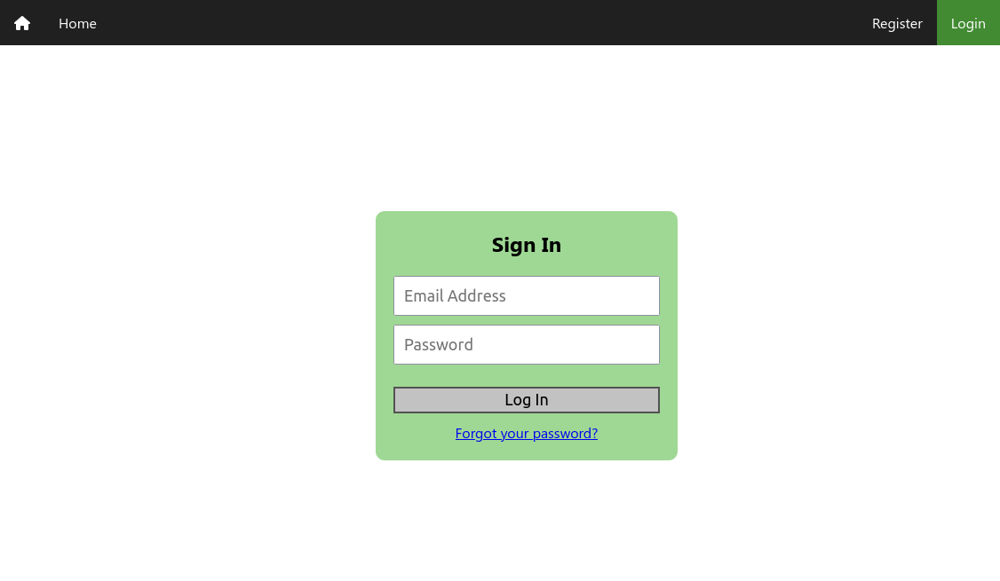
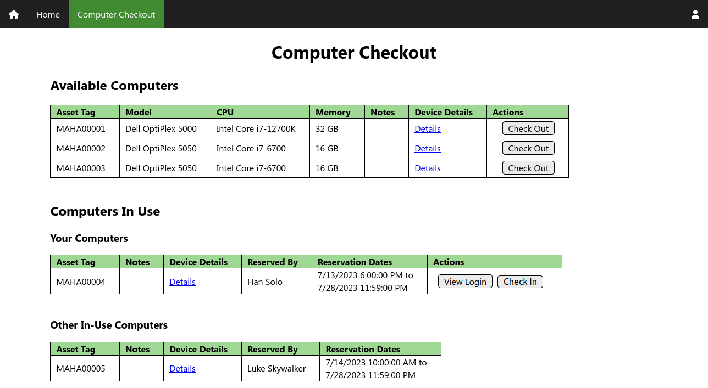

# Maha Computer Checkout Web App

## Overview

This project is a web app, built on [Google Firebase](https://firebase.google.com/) and [React](https://react.dev/), that was created to help manage shared computers at the [Maha Fluid Power Research Center](https://engineering.purdue.edu/Maha/) at [Purdue University](https://www.purdue.edu/).  At this research lab, there are a small number of extra computers that are shared among students, and we needed a way to manage reservations for these computers -- specifically, allow a single student to check out a computer for a set amount of time, after which the device would be returned for use by other students.


## Features

### Device Management

Site administrators have full permissions to add computers to the app and edit device properties (processor, memory, disk space, GPUs, etc.).  Once devices have been added, users can browse available devices and check them out.  Once a device has been checked out, it is marked unavailable to other users until the device is either returned or the reservation time limit expires.

Note that another service must be set up to provide remote connections or physical access to the computers after check-out.  The app in this repository uses [Google Remote Desktop](https://remotedesktop.google.com/) -- once users check out a device, they are provided a password/PIN to remotely access the computer through a shared Google Remote Desktop account.  However, the specific logistics can be customized to your organization's policies and systems.


### User Authentication and Management

Email/password sign-in is configured through [Firebase Authentication](https://firebase.google.com/docs/auth).  Options are provided for users to create an account and change/reset their password through a link sent to their email account.

Four levels of user permissions (external, student, faculty, and administrator) are available to restrict users' ability to view and edit data.  Here are some of the actions each permission level allows:

- `external`
  - Can sign in, sign out, and change password
  - No access to computer checkout or user data
- `student`: all permissions of `external`, plus:
  - Can see all computers that are in circulation (available, in use, or undergoing brief maintenance after being returned).  Basic device details (processor, memory, disks, etc.) are visible
  - Can check out computers for up to two weeks
- `faculty`: all permissions of `student`, plus:
  - Can view the full computer list, including devices that have been taken out of circulation (offline for long-term maintenance, broken, or otherwise retired)
  - Can view the full checkout history of all devices (to ensure devices are being shared fairly)
  - Can force immediate check-in of any device
  - Can extend users' reservations for any duration they see fit
  - Can view a list of users and their permission level (to verify data access is granted or restricted appropriately)
- `admin`: all permissions of `faculty`, plus:
  - Can add new devices and edit all device properties
  - Can view and edit login information for any device
  - Can change any user's permission level
  - Can download JSON backups of device data, login information, reservation history, and user data


### Analytics

Logging functionality through [Google Analytics](https://firebase.google.com/docs/analytics) is configured.  Users' navigation through site pages and actions such as logins, device checkout, and device check-in are logged.  This provides useful information to administrators, such as which devices are the most frequently before selecting a computer to check out.


### Backups

Administrators can download JSON backups of all device and user data.  This provides a valuable fallback in the event of a technical or user error.

In contrast to some [online solutions](https://stackoverflow.com/questions/46617960/export-json-from-firestore), this export is available in the app interface and does not require command-line tools or a paid Firebase Blaze plan, increasing ease of use.


### Flexibility and Customization

Out-of-the-box, this app provides the ability to record common computer properties (processor, memory, disks, GPUs, serial number, hostname, notes) and a fairly simple checkout/check-in workflow.

However, the app can be relatively easily customized or extended to suit your organization's needs.  For instance, the default two week reservation time limit can be modified by editing `src/constants.js` and `firestore.rules`.


### Runs on Spark Plan

Firebase offers two [plans](https://firebase.google.com/pricing): the no-cost Spark plan, and pay-by-usage Blaze plan.  This app uses only features available in the Spark plan, which is advantageous for several reasons:

  - By remaining on the Spark plan, you are guaranteed to incur no costs and are not required to provide your credit card number.
  - Firebase does not provide a hard billing limit.  Particularly for new developers, remaining on the Spark plan is helpful as it prevents the risks of making a mistake and [receiving a surprise bill](https://stackoverflow.com/questions/67731470/firebase-billing-kill-switch).

Note that [Firebase Cloud Functions](https://firebase.google.com/docs/functions) would have considerably simplified some aspects of the app's design, such as managing expired device reservations and validating data submitted through forms.  However, this integration was intentionally omitted, as it requires enabling the Blaze plan.


## Screenshots

### Home Page


### User Authentication




### Computer Checkout and Check-In




### User Management


## Installation and Deployment

Want to give the app a try?  Just follow these steps to set up your own app instance!

1. **Install Node Package Manager (npm)**: Follow [these instructions](https://docs.npmjs.com/downloading-and-installing-node-js-and-npm/) to install Node.js and npm.

2. **Install the Firebase CLI**: Follow [these instructions](https://firebase.google.com/docs/cli) to install the Firebase CLI.  This will allow you to deploy Firestore rules and indexes from your computer, as well as deploy your app's code through Firebase hosting.

3. **Create a Firebase project**: Follow the instructions in Step 1 of [this page](https://firebase.google.com/docs/web/setup) to create a new Firebase project and add a web app.  While not required, it is advised that you enable Google Analytics to use the full app functionality.

4. **Clone this Repository**: Clone the files in this repository by running:

    ```shell
    git clone https://github.com/nathan-hess/maha-computer-checkout-app.git
    ```

5. **Install Dependencies**: Install project dependencies by opening a terminal in the repository you just cloned and running:

    ```shell
    npm install
    ```

6. **Firebase Configuration**: You are welcome to customize your app's settings as you wish.  However, the following changes are required for the app to run:

    - Enable email/password authentication
    - Create a Firestore database and add a collection with the following data:

        ```jsonc
        {
            "config": {  // <-- [COLLECTION NAME]
                "help": {  // <-- [DOCUMENT NAME]
                    // A contact that will be displayed when users are
                    // checking out devices in case they need help
                    "name": "Contact Name",
                    "email": "contact.email@example.com"
                },
        
                "google_remote_desktop": {  // <-- [DOCUMENT NAME]
                    // The Google Remote Desktop account through which your
                    // organization's members can access shared devices
                    "email": "shared.email@example.com"
                }
            }
        }
        ```

7. **App Source Code Configuration**: Make the following edits to the source code in this repository:

    - Download your app's Firebase configuration through the [Firebase console general project settings](https://console.firebase.google.com/project/_/settings/general).  Save the value of ``firebaseConfig`` in ``src/firebase.js``
    - Edit ``.firebaserc`` and add your project's name

8. **Local Testing**: Want to add a new feature or customize the app for your organization?  To test and debug locally, run:

    ```shell
    npm start
    ```

9. **Build App for Production**: Run the following command to create an optimized production build with webpack:

    ```shell
    npm run build
    ```

10. **Deployment on Firebase Hosting**: Deploy the app (Firestore rules, Firestore indexes, and hosting) by running:

    ```shell
    firebase deploy
    ```

    - Once the app has deployed to Firebase hosting, you should be able to create accounts, add devices, and check out/check in computers
    - Note that in order to set up the first `admin` account, you will need to directly edit the Firestore database through the [Firebase console](https://console.firebase.google.com/).  After you've done this once, this `admin` user can edit permissions for future users.
